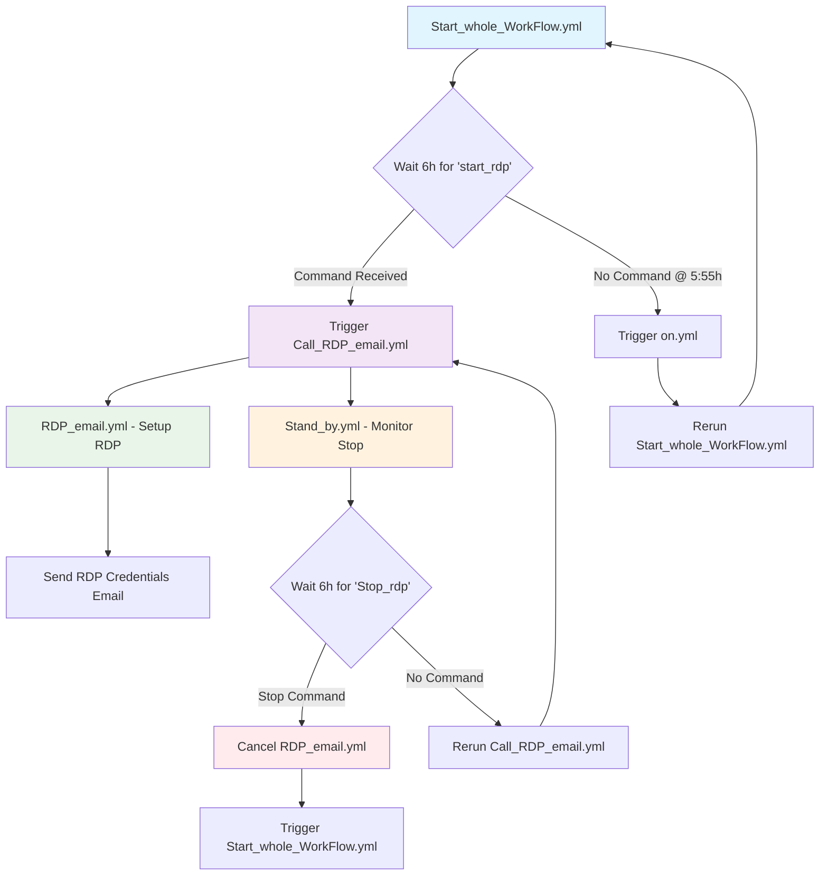

# GitHub Actions RDP Automation System

<!-- Language Badges -->


<!-- Mario Themed Badges -->


<!-- Tron Disc Badges -->


<!-- System Status Badges -->


A comprehensive GitHub Actions workflow system that provides automated RDP (Remote Desktop Protocol) access with Telegram bot control and email notifications.

## 🚀 System Overview

This project implements a continuous monitoring system that:
- Waits for Telegram commands to start/stop RDP sessions
- Automatically sets up Windows RDP with Tailscale VPN
- Provides secure access credentials via email
- Maintains 6-hour monitoring cycles
- Supports manual intervention through Telegram bot commands

## 📁 Project Structure

```
Github_Actions_project/
├── CaLL_RDP_email.yml          # Main RDP workflow trigger
├── RDP_email.yml               # Core RDP setup and configuration
├── Stand_by.yml                # Monitor for 'Stop_rdp' commands
├── Original_dontchange.yml     # Reference implementation
├── TELEGRAM_SETUP_README.md    # Telegram bot setup guide
├── README.md                   # This file
└── recive_telegram_message/
    ├── Start_whole_WorkFlow.yml # Monitor for 'start_rdp' commands
    └── on.yml                  # Workflow restart handler
```

## 🔄 Workflow Diagram



## 🔧 Setup Instructions

### 1. GitHub Secrets Configuration

Configure the following secrets in your GitHub repository settings:

| Secret Name | Description | Example |
|-------------|-------------|---------|
| `PAT_TOKEN` | GitHub Personal Access Token | `ghp_xxxxxxxxxxxx` |
| `TELEGRAM_BOT_TOKEN` | Telegram bot token from BotFather | `123456789:ABCdef...` |
| `TELEGRAM_CHAT_ID` | Your Telegram chat ID | `123456789` |
| `EMAIL_SMTP_USER` | Gmail SMTP username | `your-email@gmail.com` |
| `EMAIL_SMTP_PASS` | Gmail app password | `xxxx xxxx xxxx xxxx` |
| `EMAIL_FROM` | Sender email address | `your-email@gmail.com` |
| `EMAIL_TO` | Recipient email address | `recipient@gmail.com` |
| `TAILSCALE_AUTH_KEY` | Tailscale authentication key | `tskey-auth-xxxxx` |

### 2. Telegram Bot Setup

Follow the detailed setup guide in [TELEGRAM_SETUP_README.md](./TELEGRAM_SETUP_README.md) to:
- Create a Telegram bot using BotFather
- Obtain your chat ID
- Configure the bot for command reception

### 3. Initial Workflow Trigger

Manually run the `Start_whole_WorkFlow.yml` workflow to begin the monitoring cycle.

## 🎮 Usage Commands

### Telegram Commands

| Command | Action | Result |
|---------|--------|--------|
| `start_rdp` | Start RDP session | Triggers RDP setup and sends credentials |
| `Stop_rdp` | Stop RDP session | Cancels running RDP and restarts monitoring |

### Email Notifications

You will receive email notifications for:
- **RDP Successfully Triggered**: When start_rdp command is received
- **RDP Access Credentials**: When RDP setup completes with connection details
- **RDP Cancellation Status**: When Stop_rdp command is processed
- **Workflow Status Updates**: For various system state changes

## 📋 Workflow Details

### Core Workflows

#### Start_whole_WorkFlow.yml
- **Purpose**: Monitor for 'start_rdp' commands
- **Duration**: 6 hours
- **Trigger Conditions**: 
  - `start_rdp` received → Start RDP workflows
  - No command by 5:55h → Trigger on.yml

#### Call_RDP_email.yml
- **Purpose**: Coordinate RDP setup workflows
- **Actions**: 
  - Triggers RDP_email.yml and Stand_by.yml
  - Sends "RDP Successfully Triggered" notification

#### RDP_email.yml
- **Purpose**: Set up Windows RDP with Tailscale
- **Features**:
  - Creates secure RDP user
  - Installs and configures Tailscale
  - Sends access credentials via email
  - Maintains connection for 6 hours

#### Stand_by.yml
- **Purpose**: Monitor for 'Stop_rdp' commands
- **Actions**:
  - Cancels RDP_email.yml when stop command received
  - Triggers Start_whole_WorkFlow.yml after cancellation
  - Continues monitoring cycle if no command

#### on.yml
- **Purpose**: Simple workflow restart handler
- **Action**: Immediately reruns Start_whole_WorkFlow.yml

### Continuous Operation

The system operates in a continuous loop:
1. **Start_whole_WorkFlow** monitors for start commands
2. **on.yml** restarts the cycle if no commands received
3. **Stand_by** can interrupt and restart the cycle when stopping RDP
4. System never stops unless manually cancelled

## 🔒 Security Features

- **Secure Password Generation**: Random 16-character passwords with mixed character sets
- **Tailscale VPN**: All RDP traffic routed through secure VPN tunnel
- **Email Masking**: Sensitive information masked in GitHub logs
- **Time-Limited Access**: Automatic 6-hour session timeouts
- **Manual Override**: Telegram bot commands for immediate control

## 🛠️ Troubleshooting

### Common Issues

1. **Telegram bot not responding**
   - Verify `TELEGRAM_BOT_TOKEN` and `TELEGRAM_CHAT_ID` secrets
   - Ensure you've sent at least one message to your bot
   - Check bot permissions and active status

2. **Email notifications not received**
   - Verify Gmail app password (not regular password)
   - Check email secrets configuration
   - Ensure Gmail SMTP is enabled

3. **Workflows not triggering**
   - Verify `PAT_TOKEN` has workflow permissions
   - Check that workflow names match exactly
   - Ensure workflows have been run at least once manually

4. **RDP connection fails**
   - Verify `TAILSCALE_AUTH_KEY` is valid
   - Check Tailscale account limits
   - Ensure Tailscale network allows the connection

### Debug Steps

1. Check GitHub Actions logs for error messages
2. Verify all secrets are correctly configured
3. Test Telegram bot independently using getUpdates API
4. Confirm email delivery by checking spam folders
5. Validate Tailscale connectivity from your client

## 📊 Monitoring

### Workflow Status

Monitor your workflows through:
- GitHub Actions tab in your repository
- Email notifications for state changes
- Telegram bot responses to commands
- Workflow logs for detailed execution information

### Health Checks

The system includes:
- 10-minute heartbeat intervals (following best practices)
- Comprehensive error handling and notifications
- Automatic restart mechanisms
- Timeout protections (6-hour maximum sessions)

## 🔄 System Flow Summary

```
1. Start_whole_WorkFlow.yml starts monitoring
2. Wait for 'start_rdp' Telegram command (6 hours max)
3a. If command received: Start RDP workflows → Send credentials → Monitor for stop
3b. If no command: Trigger on.yml → Restart cycle
4. Stop command handling: Cancel RDP → Restart monitoring
5. Continuous operation with email notifications throughout
```

## 📝 Version History

- **v1.0**: Initial RDP automation with basic email notifications
- **v1.1**: Added Telegram bot integration for start/stop commands
- **v1.2**: Implemented continuous monitoring cycle with Start_whole_WorkFlow
- **v1.3**: Simplified on.yml and enhanced error handling
- **v1.4**: Added comprehensive documentation and workflow diagrams

## 🤝 Contributing

1. Fork the repository
2. Create a feature branch
3. Test your changes thoroughly
4. Update documentation as needed
5. Submit a pull request

## 📄 License

This project is provided as-is for educational and automation purposes. Ensure compliance with your organization's security policies before deployment.

## ⚠️ Important Notes

- **Security**: Never commit secrets to the repository
- **Costs**: Be aware of GitHub Actions minutes usage
- **Limits**: Respect Tailscale and email service limits
- **Testing**: Always test in a non-production environment first
- **Monitoring**: Regularly check workflow execution and logs

---

**Last Updated**: 2025-09-14  
**System Status**: Active and Monitoring  
**Support**: Check issues tab for community support